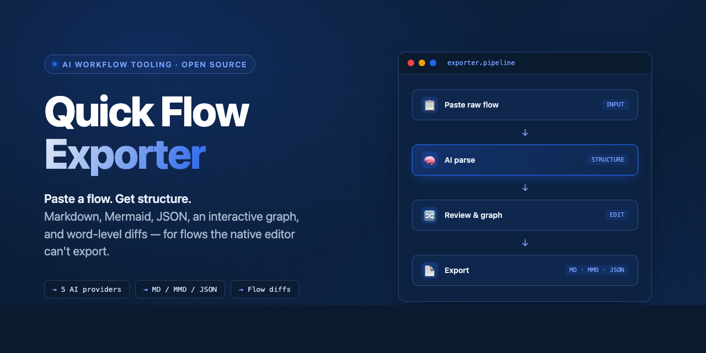

<p align="center">
  
</p>

<h1 align="center">Quick Flow Exporter</h1>

<p align="center">
  <strong>Export, diff, and visualize <a href="https://aws.amazon.com/quick/flows/">Amazon Quick Flows</a>.</strong><br />
  Paste a flow. Get Markdown, Mermaid, JSON, an interactive graph, and side-by-side diffs.
</p>

<p align="center">
  <a href="https://quick-flow-exporter.vercel.app/"></a>
</p>

<p align="center">
  <a href="#quick-start">Quick start</a> ·
  <a href="#features">Features</a> ·
  <a href="#contributing">Contribute</a>
</p>

<p align="center">
  <a href="https://github.com/florianhorner/Quick-Flow-Exporter/actions/workflows/ci.yml"></a>
  <a href="https://github.com/florianhorner/Quick-Flow-Exporter/stargazers"></a>
  <a href="https://github.com/florianhorner/Quick-Flow-Exporter/commits/main"></a>
  <a href="LICENSE"></a>
  
  
</p>

---

## Why

**The native Quick Flows editor can't export, diff, or visualize. This does all three.**

Amazon Quick Flows is AWS's visual builder for AI workflows (formerly QuickSuite). Review a teammate's flow without chasing ten tabs. Diff last week's version against today's. Drop the full flow into a design doc as Markdown or Mermaid.

## Quick Start

**Try it online** → [quick-flow-exporter.vercel.app](https://quick-flow-exporter.vercel.app/). The hosted demo uses bundled example data, so you can inspect the graph, exports, and diff workflow without sending a real flow to an AI provider.

**Run locally** (Node.js 22+, npm 10+):

```bash
git clone https://github.com/florianhorner/Quick-Flow-Exporter.git
cd Quick-Flow-Exporter
npm ci

ANTHROPIC_API_KEY=sk-... npm start
```

Open `http://localhost:5173`. Bring an API key from [Anthropic](https://console.anthropic.com/), [OpenAI](https://platform.openai.com/api-keys), [Gemini](https://aistudio.google.com/app/apikey), or [Perplexity](https://www.perplexity.ai/settings/api). For OpenAI, Gemini, Perplexity, or Bedrock see [AI Proxy Setup](docs/AI_PROXY_SETUP.md).

> If parsing fails locally, confirm `npm start` is still running and the proxy process has the right provider key.

> Under [Conductor](https://conductor.build), the **Run** button starts both processes via `scripts/conductor-run.sh` on `$CONDUCTOR_PORT`-derived ports (UI = `CONDUCTOR_PORT`, proxy = `+1`), so parallel workspaces never collide.

## Troubleshooting

| Symptom                                | Cause                                                               | Fix                                                                                                                  |
| -------------------------------------- | ------------------------------------------------------------------- | -------------------------------------------------------------------------------------------------------------------- |
| **Parse & Extract greyed out**         | Proxy not running, or no API key for the selected provider          | Confirm `npm start` is still running; make sure the provider key matches the provider you picked in the UI           |
| **`429 Too Many Requests`**            | Rate limit — 20 requests / 60s per IP by default                    | Wait for the `Retry-After` window, or raise `RATE_LIMIT` on the proxy (see [AI Proxy Setup](docs/AI_PROXY_SETUP.md)) |
| **`401` / auth error**                 | Wrong or expired key, or key for a different provider               | Re-enter the key for the selected provider; keys are stored per browser, not shared across providers                 |
| **Paste rejected as too large**        | Flow exceeds the 500 KB request cap                                 | Trim the pasted flow, or export fewer steps from the editor                                                          |
| **CORS error on a self-hosted deploy** | Proxy `CORS_ORIGIN` defaults to `http://localhost:5173`             | Set `CORS_ORIGIN` to your deployed frontend origin                                                                   |
| **Extension doesn't capture**          | Not on a Quick Flows editor tab, or installed before the tab loaded | Open the Quick Flows editor, reload the tab, then click the extension                                                |

## Features

- 🧠 **Five AI providers** — Anthropic, OpenAI, Gemini, Perplexity, AWS Bedrock. Switch per request; keys stay on your machine via local proxy.
- 🔀 **Dependency graph** — color-coded DAG with `@reference` edges, reasoning-group subgraphs, and a minimap.
- 🔍 **Version diffs** — word-level inline changes between any two flow versions, no git required.
- 📄 **Three export formats** — Markdown for docs, Mermaid for GitHub and Quip, JSON for round-tripping.
- ✏️ **Edit before export** — reorder steps, refine prompts, adjust settings.
- 🧩 **One-click capture** — Chrome/Edge extension pulls flows straight from the editor.
- 🌗 **Light & dark mode** — system-detected, persisted.

See [docs/STEP_TYPES.md](docs/STEP_TYPES.md) for every supported step type.

## Screenshots

Copy your flow from the Quick Flows editor (Ctrl+A → Ctrl+C), or use the [Chrome/Edge extension](docs/BROWSER_EXTENSION.md) for one-click capture.

| 1. Paste a flow, get structured steps               | 2. Diff two versions, word-level                  |
| --------------------------------------------------- | ------------------------------------------------- |
|  |  |

| 3. Explore dependencies as a graph                | 4. Export to Markdown, Mermaid, JSON                  |
| ------------------------------------------------- | ----------------------------------------------------- |
|  |  |

## Resources

- **[Architecture](docs/ARCHITECTURE.md)** — the six-phase pipeline and project layout
- **[AI Proxy Setup](docs/AI_PROXY_SETUP.md)** — provider configs, env vars, per-request switching
- **[Browser Extension](docs/BROWSER_EXTENSION.md)** — install the Chrome/Edge capture extension
- **[Step Types](docs/STEP_TYPES.md)** — every Quick Flows step type and how it renders
- **[Scripts](docs/SCRIPTS.md)** — npm scripts, tech stack, prerequisites

## Roadmap

**Shipped**

- [x] Browser extension (Chrome/Edge)
- [x] Light & dark mode

**Next**

- [ ] Flow analytics (prompt complexity, reference graph completeness, cost estimation)
- [ ] Shareable links (encode flow in URL for Slack/email sharing)

**Nice-to-have**

- [ ] Keyboard shortcuts
- [ ] `npx quick-flow-exporter` for zero-setup local usage

## Contributing

Issues, PRs, and feedback all move this forward.

1. Fork, clone, and run `npm ci`.
2. Branch off main: `git checkout -b feat/your-idea`.
3. Before opening a PR: `npm run lint && npm run test && npm run typecheck`.

See [CONTRIBUTING.md](CONTRIBUTING.md) for the full guide.

## License

[MIT](LICENSE)

<!--
## Star history

Uncomment once the repo hits ~50 stars — shows growth curve.

<a href="https://star-history.com/#florianhorner/Quick-Flow-Exporter&Date">
  
</a>
-->
