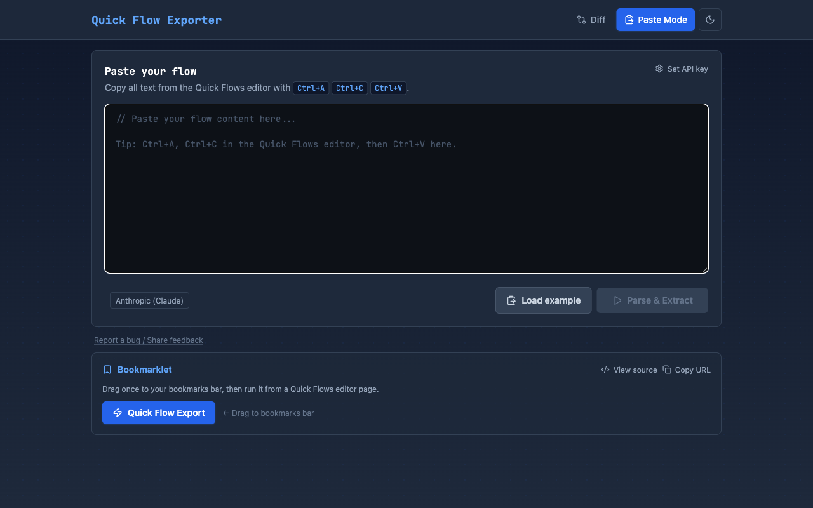
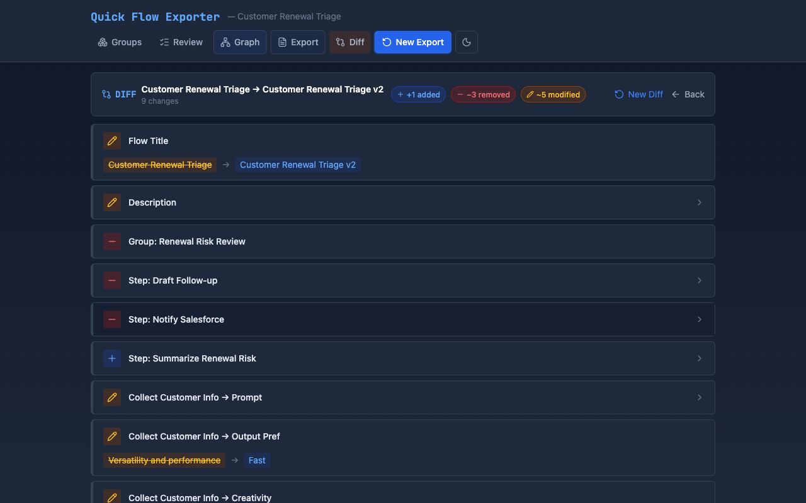
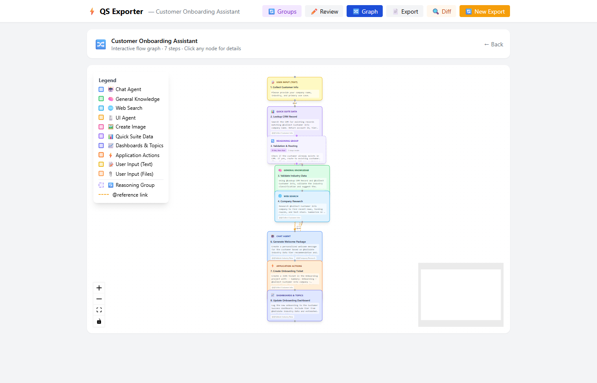
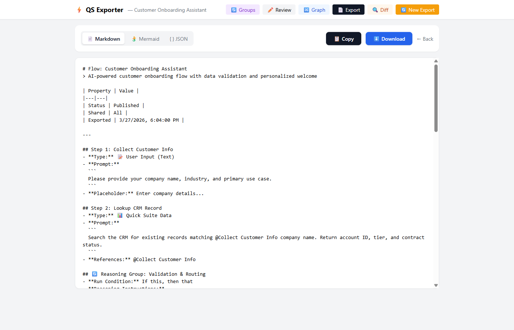

# ⚡ Quick Flow Exporter

Extract, visualize, diff, and document your [Amazon Quick Flows](https://aws.amazon.com/quick/flows/) — because the tool doesn't come with a native way to do it.


## Why This Exists

Amazon Quick Flows (formerly QuickSuite) lets you build AI-powered workflows with a visual editor. But there's no built-in way to:

- **Export** the prompts, logic, and step configuration as text
- **Visualize** the flow as a graph with data dependencies
- **Diff** two versions of a flow to see what changed
- **Document** flows for reviews, audits, or knowledge sharing

This tool fills that gap.

## Screenshots

### Paste & Parse
Ctrl+A your flow in the Quick Flows editor, paste it here, and AI extracts the full structure.



### Flow Diff
Compare two versions of a flow side-by-side with word-level inline diffs on prompts.



### Interactive Flow Graph
Visualize your flow as a color-coded directed graph. Each step type has its own color, `@references` show as dashed edges, and reasoning groups render as sub-graphs. Click any node to see the full prompt in a detail panel.



### Multi-Format Export
Export to Markdown (documentation), Mermaid (flowchart diagrams for GitHub/Quip), or JSON (canonical, re-importable).



### One-Click Bookmarklet
Drag the bookmarklet to your bookmarks bar. One click on any Quick Flows editor page copies the content to your clipboard — no Ctrl+A needed.

## Features

| Feature | Description |
|---------|-------------|
| 🧠 AI-Powered Parsing | Paste raw editor content → structured flow with steps, groups, conditions |
| 🔀 Interactive Graph | React Flow-powered DAG with color-coded nodes, @reference edges, minimap |
| 🔍 Flow Diffing | Side-by-side comparison with word-level diffs (added/removed/modified) |
| 📄 Markdown Export | Human-readable documentation with full prompt text |
| 🧜 Mermaid Export | Flowchart diagrams that render in GitHub, Quip, mermaid.live |
| { } JSON Export | Canonical format for version control and re-import |
| 🔖 Bookmarklet | One-click content extraction from the Quick Flows editor |
| ✏️ Review & Edit | Reorder steps, edit prompts, adjust settings before export |
| 🔄 Reasoning Groups | Full support for conditional logic groups with run conditions |

## Supported Step Types

| Type | Icon | Description |
|------|------|-------------|
| Chat Agent | 🤖 | Conversational AI agent |
| General Knowledge | 🧠 | LLM-powered knowledge step |
| Web Search | 🌐 | Internet search step |
| UI Agent | 🖱️ | Browser automation |
| Create Image | 🖼️ | Image generation |
| Quick Suite Data | 📊 | Internal data queries |
| Dashboards & Topics | 📈 | BI dashboard integration |
| Application Actions | ⚡ | External system actions |
| User Input (Text) | 📝 | Text input from user |
| User Input (Files) | 📎 | File upload from user |

## Quick Start

```bash
git clone https://github.com/florianhorner/Quick-Flow-Exporter.git
cd Quick-Flow-Exporter
npm install
npm run dev
```

Open `http://localhost:5173` in your browser.

## AI Proxy Setup

The parser uses AI to extract structured data from raw pasted text. Requests go through a local proxy to keep API keys out of the browser.

### Anthropic (Claude)

```bash
ANTHROPIC_API_KEY=sk-... npx tsx server/proxy.ts
```

### AWS Bedrock

```bash
npm install @aws-sdk/client-bedrock-runtime
PROVIDER=bedrock AWS_REGION=us-east-1 npx tsx server/proxy.ts
```

Uses your default AWS credentials (`~/.aws/credentials` or environment variables).

### Any OpenAI-compatible API

Adapt `server/proxy.ts` — it's a single function swap. PRs welcome.

> The Vite dev server proxies `/api` requests to `http://localhost:3001` automatically.

## How It Works

```
┌─────────────┐     ┌──────────────┐     ┌──────────────┐     ┌──────────────┐
│  Paste raw   │────▶│  AI parses   │────▶│  Review &    │────▶│  Export as   │
│  flow text   │     │  structure   │     │  edit flow   │     │  MD/Mermaid  │
└─────────────┘     └──────────────┘     └──────────────┘     └──────────────┘
                                                │
                                          ┌─────┴─────┐
                                          │ View as   │
                                          │ graph     │
                                          └───────────┘
```

1. **Paste** — Copy the raw content from the Quick Flows editor (Ctrl+A → Ctrl+C) and paste it
2. **Parse** — AI extracts the structured flow: steps, groups, conditions, prompts, references
3. **Groups** — If reasoning groups are detected, optionally paste their instructions for extraction
4. **Review** — Edit steps, reorder, tweak prompts, adjust settings
5. **Graph** — Visualize the flow as an interactive directed graph
6. **Export** — Copy or download as Markdown, Mermaid, or JSON
7. **Diff** — Compare two flow versions to see exactly what changed

## Project Structure

```
src/
├── types.ts                     # TypeScript type definitions
├── constants.ts                 # Step types, output prefs, run conditions
├── lib/
│   ├── ai.ts                    # AI proxy client
│   ├── diff.ts                  # Flow diff engine (word-level diffs)
│   ├── flow.ts                  # Flow/Step/Group factories & helpers
│   ├── markdown.ts              # Markdown export generator
│   ├── mermaid.ts               # Mermaid flowchart generator
│   ├── parser.ts                # AI-powered flow & group parsing
│   ├── prompts.ts               # LLM system prompts
│   └── storage.ts               # Export history persistence
├── components/
│   ├── BookmarkletPanel.tsx      # Draggable bookmarklet for Quick Flows
│   ├── DiffPhase.tsx             # Side-by-side flow comparison UI
│   ├── ExportPhase.tsx           # Multi-format export (MD/Mermaid/JSON)
│   ├── FlowGraph.tsx             # Interactive React Flow graph
│   ├── GroupCard.tsx             # Editable reasoning group
│   ├── GroupInstructionCard.tsx   # AI extraction for group instructions
│   ├── GroupsPhase.tsx           # Group instruction extraction wizard
│   ├── PastePhase.tsx            # Raw text paste & parse
│   ├── ReviewPhase.tsx           # Full flow editor
│   ├── StepCard.tsx              # Collapsible step editor
│   ├── StepFields.tsx            # Step-type-specific form fields
│   └── ErrorBoundary.tsx         # Catch rendering errors gracefully
├── App.tsx                       # Main app with phase navigation
├── main.tsx                      # Entry point
└── index.css                     # Tailwind imports
server/
├── proxy.ts                      # AI proxy server (Anthropic / Bedrock)
└── proxy-utils.ts                # Shared proxy utilities (rate limiter, validation)
```

## Tech Stack

- **React 19** + TypeScript
- **Tailwind CSS** for styling
- **React Flow** for the interactive graph visualization
- **diff-match-patch** for word-level text diffing
- **Vite** for dev/build tooling

## Scripts

| Command | Description |
|---------|-------------|
| `npm run dev` | Start dev server at localhost:5173 |
| `npm run build` | Type-check and build for production |
| `npm run preview` | Preview production build |
| `npm run lint` | Run ESLint |

## Roadmap

- [ ] Browser extension (Chrome/Edge) for zero-friction extraction
- [ ] Flow analytics (prompt complexity, reference graph completeness, cost estimation)
- [ ] Shareable links (encode flow in URL for Slack/email sharing)
- [x] ~~Dark mode~~ (ships with dark theme by default)
- [ ] Keyboard shortcuts
- [ ] `npx quick-flow-exporter` for zero-setup local usage

## Contributing

Contributions welcome. See [CONTRIBUTING.md](CONTRIBUTING.md) for guidelines.

## License

[MIT](LICENSE)
